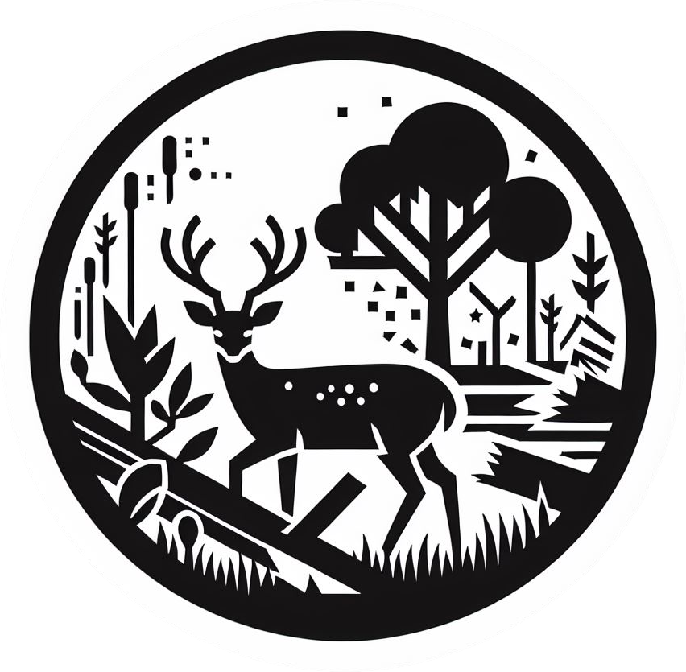

# True costs of invasive deer

Code and data accompanying paper and Honours thesis to calculate the economic costs of invasive deer (Cervidae) globally and in Australia, and the return on investment in their management. 
 
<a href="https://globalecologyflinders.com/people/#MTL">Martha Thallas-Lamb</a> 
<a href="https://globalecologyflinders.com">Global Ecology</a>, <a href="https://flinders.edu.au">Flinders University</a> 
<a href="mailto:martha.thallaslamb@flinders.edu.au">e-mail</a> 
 
and 
 
Professor <a href="https://globalecologyflinders.com/people/#CJAB">Corey J. A. Bradshaw</a> 
<a href="https://globalecologyflinders.com">Global Ecology</a>, <a href="https://flinders.edu.au">Flinders University</a> 
<a href="mailto:corey.bradshaw@flinders.edu.au">e-mail</a> 

## <a href="https://github.com/MarthaThallasLamb/Understanding-the-True-Costs-of-Invasive-Deer/tree/main/scripts">Scripts</a>
- <code>cost_benefit.R</code>: cost-benefit analysis script for eradication program
- <code>cum_avg_ann_costs.R</code>: cumulative average annual costs analysis
- <code>damage_vs_management_costs.R</code>: comparison of damage versus management costs of invasive deer
- <code>data_check_aggreg.R</code>: data check and aggregation script for cervidae
- <code>deer_biomass_proj.R</code>: estimate invasive deer biomass in Australia and project through time
- <code>deer_costs_from_biomass.R</code>: calculate costs from biomass estimates and project costs through time
- <code>gdp_analysis.R</code>: put cost estimates into context of Australian gross domestic product
- <code>geogr_distrib_costs.R</code>: show geographic distribution of invasive deer costs in Australia
- <code>temporal_analysis.R</code>: temporal analysis script for cost modelling

## Data
- dataset1:

## Required R libraries
<code>dplyr</code>, <code>ggplot2</code>, <code>gt</code>, <code>invacost</code>, <code>maps</code>, <code>ozmaps</code>, <code>patchwork</code>, <code>plyr</code>, <code>purrr</code>, <code>readr</code>, <code>rnaturalearth</code>, <code>scales</code>, <code>sf</code>, <code>sp</code>, <code>tidyverse</code>, <code>tmap</code>, <code>tools</code>

 
 

 &nbsp;  &nbsp; 

